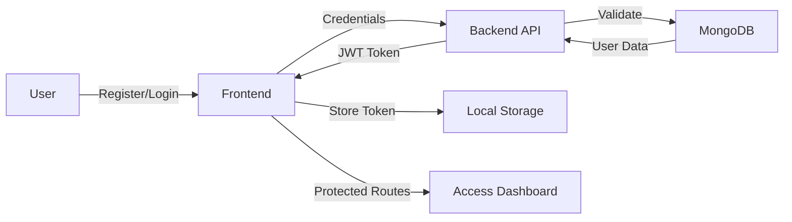

<div align="center">
  
# 💛 Next Role

### *Connect Talent with Opportunity*

<p align="center">
  
  
  
  
</p>

<p align="center">
  A modern, full-stack job portal built with the MERN stack—connecting job seekers with recruiters through an intuitive, animated, and responsive platform.
</p>

[Features](#-features) • [Demo](#-demo) • [Tech Stack](#️-tech-stack) • [Getting Started](#-getting-started) • [Contributing](#-contributing)

---

</div>

## 📸 Demo

> Add screenshots or GIFs of your application here

<div align="center">
  
</div>

---

## ✨ Features

<table>
<tr>
<td width="50%">

### 🎓 For Job Seekers

- 🔍 **Smart Job Search** - Filter by location, role, and salary
- 📝 **One-Click Applications** - Apply instantly with saved profiles
- 📊 **Application Tracker** - Monitor your application status in real-time
- 🔔 **Job Alerts** - Get notified about matching opportunities
- 💼 **Profile Management** - Upload resume and showcase skills

</td>
<td width="50%">

### 🧑‍💼 For Recruiters

- ✍️ **Easy Job Posting** - Create listings in minutes
- 👥 **Applicant Management** - Review and filter candidates
- 📈 **Analytics Dashboard** - Track job performance metrics
- ✏️ **Edit & Manage** - Update or remove job postings anytime
- 🎯 **Targeted Reach** - Connect with qualified candidates

</td>
</tr>
</table>

### 🔐 Core Features

- **Secure Authentication** - JWT-based login system with role-based access control
- **Responsive Design** - Seamless experience across mobile, tablet, and desktop
- **Real-time Updates** - Instant notifications for applications and job posts
- **Cloud Storage** - Profile images and resumes stored on Cloudinary
- **Modern UI/UX** - Beautiful interfaces powered by shadcn/ui and Framer Motion

---

## 🛠️ Tech Stack

### Frontend
```
⚛️  React.js          - Component-based UI library
🎨  Tailwind CSS      - Utility-first CSS framework
🎭  shadcn/ui         - Accessible component library
✨  Framer Motion     - Animation library
🧭  React Router      - Client-side routing
🔌  Axios             - HTTP client
```

### Backend
```
🟢  Node.js           - JavaScript runtime
⚡  Express.js        - Web application framework
🍃  MongoDB           - NoSQL database
📦  Mongoose          - MongoDB ODM
🔑  JWT               - Authentication tokens
☁️  Cloudinary        - Media storage
```

---

## 📁 Project Structure

```
next-role/
│
├── client/                 # Frontend React application
│   ├── src/
│   │   ├── components/     # Reusable UI components
│   │   ├── pages/          # Page components
│   │   ├── hooks/          # Custom React hooks
│   │   ├── utils/          # Helper functions
│   │   ├── redux/          # State management
│   │   └── App.jsx         # Root component
│   └── package.json
│
├── server/                 # Backend Express API
│   ├── controllers/        # Request handlers
│   ├── models/             # Database schemas
│   ├── routes/             # API endpoints
│   ├── middlewares/        # Auth & validation
│   ├── utils/              # Helper functions
│   └── index.js            # Server entry point
│
└── README.md
```

---

## 🚀 Getting Started

### Prerequisites

Before you begin, ensure you have the following installed:
- **Node.js** (v14 or higher)
- **MongoDB** (local or MongoDB Atlas account)
- **npm** or **yarn**

### Installation

**1. Clone the repository**
```bash
git clone https://github.com/p-thanks/Next-Role.git
cd Next-Role
```

**2. Setup Backend**
```bash
cd server
npm install
```

Create a `.env` file in the `server` directory:
```env
MONGODB_URI=your_mongodb_connection_string
PORT=8000
SECRET_KEY=your_jwt_secret_key

CLOUDINARY_API_KEY=your_cloudinary_api_key
CLOUDINARY_SECRET_KEY=your_cloudinary_secret_key
CLOUDINARY_NAME=your_cloudinary_cloud_name

NODE_ENV=development
```

**3. Setup Frontend**
```bash
cd ../client
npm install
```

**4. Run the Application**

Open two terminal windows:

```bash
# Terminal 1 - Start backend server
cd server
npm run dev
```

```bash
# Terminal 2 - Start frontend
cd client
npm run dev
```

**5. Access the Application**
- 🌐 Frontend: `http://localhost:5173`
- 🔌 Backend API: `http://localhost:8000`

---

## 🔒 Authentication Flow



1. Users register or login with email and password
2. Backend validates credentials and issues JWT token
3. Token is stored securely on the client
4. Protected routes verify token for access control
5. Role-based permissions (Student/Recruiter) enforce authorization

---

## 🎨 UI Components

The application uses **shadcn/ui** for consistent, accessible components:

- 📋 **Forms** - Input fields, textareas, and file uploads
- 🔘 **Buttons** - Primary, secondary, and outline variants
- 📊 **Cards** - Job listings and application cards
- 🗂️ **Tables** - Applicant management tables
- 🎭 **Modals** - Confirmation dialogs and forms
- 🎬 **Animations** - Smooth transitions with Framer Motion

---

## 📸 Screenshots

<div align="center">

### Landing Page


### Job Listings


### Recruiter Dashboard


</div>

---

## 🤝 Contributing

Contributions are what make the open-source community amazing! Any contributions you make are **greatly appreciated**.

1. **Fork** the Project
2. **Create** your Feature Branch (`git checkout -b feature/AmazingFeature`)
3. **Commit** your Changes (`git commit -m 'Add some AmazingFeature'`)
4. **Push** to the Branch (`git push origin feature/AmazingFeature`)
5. **Open** a Pull Request

---

## 📝 License

This project is licensed under the **MIT License** - see the [LICENSE](LICENSE) file for details.

---

## 👨‍💻 Author

<div align="center">

### Made with 💛 by **Pthaks**

[](https://www.linkedin.com/in/paul-thanksgiving-800867309)
[](https://github.com/p-thanks)

</div>

---

## 🙏 Acknowledgments

- [React Documentation](https://react.dev/)
- [Tailwind CSS](https://tailwindcss.com/)
- [shadcn/ui](https://ui.shadcn.com/)
- [MongoDB Documentation](https://docs.mongodb.com/)
- [Express.js](https://expressjs.com/)

---

<div align="center">

### ⭐ Star this repo if you find it helpful!

**Built with passion for connecting talent with opportunity** 🚀

</div>